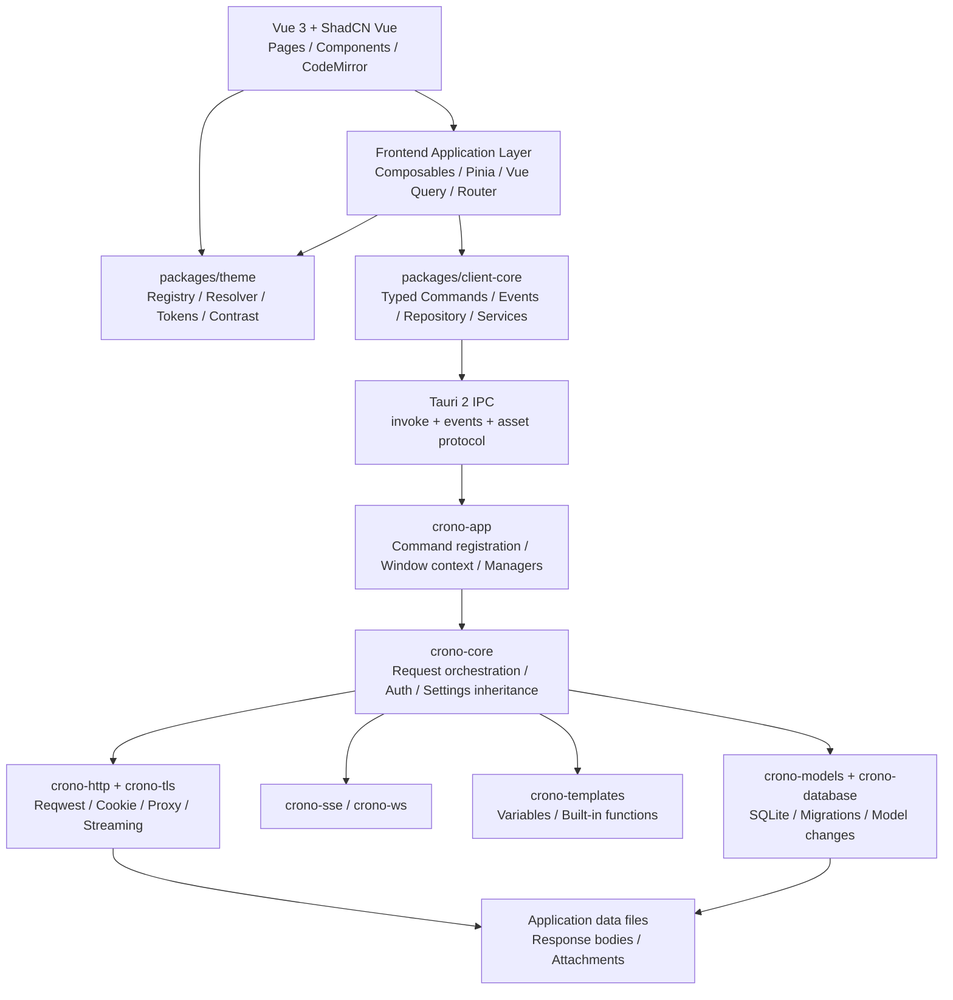
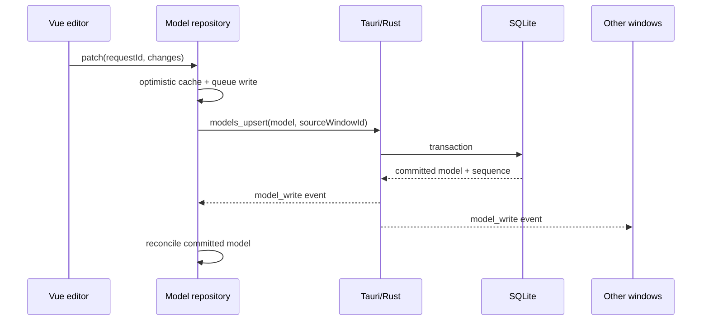
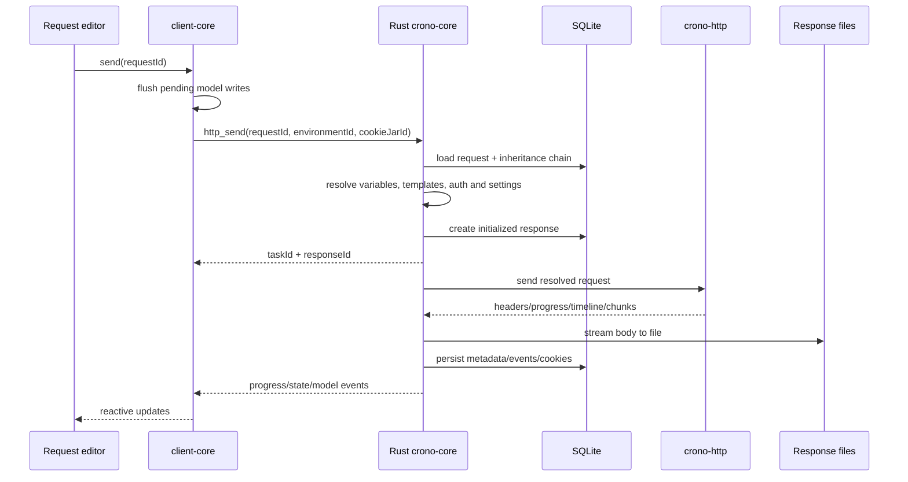

# Crono 架构与实施蓝图

> 状态：Draft for Review  
> 项目：Crono  
> 技术栈：Vue 3、TypeScript、ShadCN Vue、Tailwind CSS、Tauri 2、Rust、SQLite  
> 参考实现：Yaak  
> 本文目标：在开始编码前固定产品范围、系统边界、协议、质量门槛和实施顺序。

## 1. 产品定位

Crono 是一个本地优先、跨平台的桌面 API 客户端。它借鉴 Yaak 的信息架构、请求编辑体验和 Rust 网络核心设计，但以 Vue 3 和 ShadCN Vue 重建前端，并从第一天支持国际化。

Crono 不是 Yaak 的逐文件翻译，也不追求与 Yaak 的内部协议长期兼容。可复用代码应经过依赖审计、重命名和裁剪，形成由 Crono 自己维护的稳定边界。

### 1.1 核心目标

- 提供专业、紧凑、键盘友好的 HTTP API 调试体验。
- 由 Rust 负责网络、持久化、敏感数据和桌面系统能力。
- 由 Vue 负责展示、编辑和页面级交互，不在组件中散落 Tauri 调用。
- 支持工作区、目录、环境变量、Cookie、请求历史和大响应。
- 支持简体中文和英文，并允许运行时切换语言。
- 保持核心模块可测试、可替换，不与具体前端状态库强绑定。

### 1.2 明确不做

- 不实现插件系统。
- 不内置或分发 Node.js 运行时。
- 不实现 gRPC、Server Reflection、Proto 编译和 streaming RPC。
- 不内置或分发 `protoc.exe`。
- 第一阶段不实现团队云同步、Git 同步、账号、许可证和商业功能。
- 第一阶段不追求移动端；目标平台是 Windows、macOS 和 Linux 桌面。

## 2. 功能范围

| 能力 | MVP | 后续 | 不做 |
|---|---:|---:|---:|
| Workspace / Folder / Request CRUD | ✓ |  |  |
| HTTP/1.1、HTTP/2 | ✓ |  |  |
| Query、Header、Text/JSON/XML/Form/Multipart/Binary Body | ✓ |  |  |
| Basic、Bearer、API Key 认证 | ✓ |  |  |
| OAuth 2.0 辅助流程 |  | ✓ |  |
| Cookie Jar、Redirect、Proxy、TLS、客户端证书 | ✓ |  |  |
| 环境变量、继承设置、内建模板函数 | ✓ |  |  |
| 请求取消、历史、Timeline、大响应、文件保存 | ✓ |  |  |
| SSE | ✓ |  |  |
| GraphQL 编辑、格式化、Introspection、补全 |  | ✓ |  |
| WebSocket |  | ✓ |  |
| cURL / OpenAPI / Postman 导入 |  | ✓ |  |
| 数据导出与备份 |  | ✓ |  |
| 插件和 Node.js |  |  | ✓ |
| gRPC 和 protoc |  |  | ✓ |

MVP 的完成定义是形成可靠的 HTTP 垂直闭环，而不是仅完成静态页面。

## 3. 架构原则

1. Rust 和 SQLite 是持久化事实来源；Pinia 是当前窗口的响应式缓存。
2. Vue 组件只依赖 composable、store 或 `client-core` 的业务接口。
3. 所有请求发送入口必须先等待模型写入完成。
4. 大型或二进制正文存放在文件系统，不能进入 Pinia 或通过 Tauri 事件整块广播。
5. Tauri command 和 event 是版本化契约，不把 Rust 内部类型随意暴露给前端。
6. 后端返回错误码和参数，前端负责本地化用户文案。
7. 长连接和流式任务必须有明确的所有者、取消协议和资源释放路径。
8. 每个阶段交付可运行的垂直切片，并通过对应验收门槛后再扩展。
9. 复制或改写 Yaak 的实质性代码时保留 MIT 许可证声明和第三方归属。

## 4. 总体架构



### 4.1 层级职责

| 层 | 负责 | 不负责 |
|---|---|---|
| Vue Components | 渲染、输入、无障碍语义、局部交互 | 调用原始 Tauri command、持久化 |
| Composables | 页面行为、编辑会话、订阅生命周期 | 数据库和网络实现 |
| Pinia | 响应式模型索引、当前选择、纯 UI 状态 | 成为唯一事实来源 |
| Vue Query | 一次性命令、加载和错误状态 | 长连接事件流和模型事实 |
| `theme` | 声明式主题、token 补全、CSS 生成、对比度验证 | 插件加载和业务状态 |
| `client-core` | 类型化 IPC、模型仓库、pending writes、服务 API | Vue 组件和视觉样式 |
| Tauri Adapter | 注册 command、窗口上下文、事件转发、系统能力 | 复杂业务规则 |
| Rust Domain | 继承、模板、认证、请求编排、任务管理 | UI 本地化 |
| Network | HTTP/TLS/Proxy/Cookie/Streaming | 页面状态 |
| Models | SQLite、迁移、查询、变更日志 | 前端展示状态 |

## 5. 建议仓库结构

```text
crono/
├─ apps/
│  └─ desktop/
│     ├─ src/
│     │  ├─ app/
│     │  ├─ components/
│     │  ├─ composables/
│     │  ├─ features/
│     │  │  ├─ workspaces/
│     │  │  ├─ requests/
│     │  │  ├─ responses/
│     │  │  ├─ environments/
│     │  │  └─ settings/
│     │  ├─ i18n/
│     │  ├─ router/
│     │  ├─ stores/
│     │  └─ styles/
│     └─ package.json
├─ packages/
│  ├─ client-core/
│  │  └─ src/
│  │     ├─ commands/
│  │     ├─ events/
│  │     ├─ repository/
│  │     ├─ services/
│  │     └─ types/
│  ├─ ui/
│  │  └─ src/
│  │     ├─ components/ui/
│  │     ├─ components/crono/
│  │     └─ styles/
│  ├─ theme/
│  │  └─ src/
│  │     ├─ builtins/
│  │     ├─ color/
│  │     ├─ registry.ts
│  │     ├─ resolver.ts
│  │     ├─ schema.ts
│  │     └─ tokens.ts
│  └─ shared/
├─ crates/
│  ├─ crono-core/
│  ├─ crono-database/
│  ├─ crono-http/
│  ├─ crono-models/
│  ├─ crono-sse/
│  ├─ crono-templates/
│  ├─ crono-tls/
│  └─ crono-ws/
├─ crates-tauri/
│  └─ crono-app/
│     ├─ capabilities/
│     ├─ icons/
│     ├─ src/
│     ├─ Cargo.toml
│     └─ tauri.conf.json
├─ docs/
│  ├─ adr/
│  ├─ contracts/
│  └─ testing/
├─ Cargo.toml
├─ package.json
├─ tsconfig.json
└─ ARCHITECTURE.md
```

### 5.1 前端组织规则

- `features/` 按业务领域组织，不建立巨大的全局 `components/`。
- `components/ui/` 保存 ShadCN Vue 基础组件源码。
- `components/crono/` 保存 Crono 组合组件，例如键值表格、请求标签页和响应查看器。
- `packages/theme` 保存框架无关的主题类型、内置主题、颜色计算、token 补全和 CSS 生成。
- `client-core` 不导入 Vue、Pinia、Vue Query 或浏览器组件。
- Store 通过 adapter 订阅 `client-core`，便于独立测试模型同步。
- 生成的 Rust TypeScript bindings 放在 `packages/client-core/src/types/generated/`，禁止手改。

### 5.2 Rust crate 边界

- `crono-models`：领域模型、查询接口、迁移入口和 TS 类型生成。
- `crono-database`：SQLite 连接、事务、migration runner。
- `crono-http`：可发送请求、连接池、DNS、代理、Cookie、压缩和响应流。
- `crono-tls`：证书、平台根证书、自签名策略和客户端证书。
- `crono-templates`：变量解析和内建函数；不得依赖 Node。
- `crono-core`：读取模型、合并继承设置、渲染、认证、发送、持久化。
- `crono-sse`、`crono-ws`：独立流协议模型与生命周期。
- `crono-app`：唯一直接依赖 Tauri 的业务 crate。

## 6. Yaak 复用与裁剪策略

Yaak 使用 MIT License。允许复用和修改，但复制实质性代码时必须保留其版权与许可证声明。

### 6.1 建议复用

- `yaak-http` 的请求发送、连接配置、压缩、DNS override、代理和流式处理设计。
- `yaak-tls` 的证书加载与平台差异处理。
- `yaak-models` 的迁移、查询、模型变更和响应 body 文件管理思路。
- `yaak-sse`、`yaak-ws` 中与插件和 gRPC 无关的协议代码。
- HTTP response timeline、取消、按需读取 body 的设计。
- Rust 生成 TypeScript bindings 的流程。
- CodeMirror 的纯语言扩展和格式化工具。
- `packages/theme` 的 appearance 解析、颜色补全、组件级覆盖和启动前应用主题的设计。
- `plugins/themes-yaak` 中经过许可证复核、重命名和对比度验证的声明式配色数据。

### 6.2 必须改写或解耦

- 所有 React、Jotai、React Query 和 TanStack React Router 代码。
- `yaak-app-client` 中混合了 gRPC、插件、许可、同步和更新的 command 注册。
- `yaak` 中对 `yaak-plugins` 的认证和模板调用。
- 动态插件表单、prompt、action、plugin event 和 Node runtime。
- Yaak 通过插件 command 动态获取主题的机制；Crono 使用构建时静态主题注册表。
- gRPC 模型、查询、migration、命令、vendored protoc 和打包资源。
- Yaak 品牌、应用标识、深链接 scheme 和资源路径。

### 6.3 复用方式

不将 Yaak 仓库作为运行时 Git 依赖。采用“选择性移植”的方式：

1. 标记来源文件和许可证。
2. 先写 Crono 需要的公共接口和测试。
3. 移植最小实现并重命名 crate/module。
4. 删除插件、gRPC、同步和商业功能依赖。
5. 通过行为测试确认与参考实现一致。

这样可以避免未来 Yaak 内部重构直接破坏 Crono。

## 7. 核心数据模型

所有持久化模型包含 `id`、`createdAt`、`updatedAt`。需要排序的树节点包含 `sortPriority`。模型 ID 使用带前缀的随机 ID，方便诊断，例如 `wk_`、`fl_`、`rq_`、`rs_`。

### 7.1 MVP 模型

| 模型 | 关键字段 |
|---|---|
| `Settings` | locale、appearance、themeLight、themeDark、font、scale、editor、proxy、certificates、hotkeys |
| `Workspace` | name、description、default headers、auth、HTTP inherited settings |
| `Folder` | workspaceId、folderId、name、headers、auth、inherited settings、sortPriority |
| `Environment` | workspaceId、parentId、name、variables、color、sortPriority |
| `CookieJar` | workspaceId、name、cookies |
| `HttpRequest` | workspaceId、folderId、name、method、url、parameters、headers、body、auth、settings |
| `HttpResponse` | requestId、status、headers、timing、bodyPath、size、errorCode、state |
| `HttpResponseEvent` | responseId、sequence、timestamp、event payload |
| `ModelChange` | sequence、sourceWindowId、operation、modelType、payload |

后续增加 `GraphqlSchemaCache`、`WebsocketRequest`、`WebsocketConnection` 和 `WebsocketEvent`。

### 7.2 请求 Body

请求 body 使用显式 tagged union，不使用任意 `Record<string, any>`：

```ts
type HttpRequestBody =
  | { type: "none" }
  | { type: "text"; text: string; contentType?: string }
  | { type: "json"; text: string }
  | { type: "xml"; text: string }
  | { type: "formUrlEncoded"; entries: KeyValueEntry[] }
  | { type: "multipart"; entries: MultipartEntry[] }
  | { type: "binary"; filePath: string };
```

认证同样使用显式联合类型：

```ts
type HttpAuthentication =
  | { type: "none" }
  | { type: "inherit" }
  | { type: "basic"; username: string; password: SecretValue }
  | { type: "bearer"; token: SecretValue }
  | { type: "apiKey"; placement: "header" | "query"; name: string; value: SecretValue };
```

明确类型能降低插件删除后的不确定性，也便于 Rust/TypeScript 契约生成。

### 7.3 设置继承

Workspace、Folder、Request 形成从宽到窄的设置链。Request 发送时生成不可变的 `ResolvedRequestConfig`：

```text
Application defaults
  → Workspace
    → Parent folders from root to leaf
      → Request
```

可继承项包括 headers、authentication、follow redirects、certificate validation、timeout、send/store cookies 和最大请求大小。响应 timeline 必须记录每项最终值及来源，便于用户解释“为什么这样发送”。

### 7.4 数据库

- SQLite 启用 foreign keys 和 WAL。
- 所有 schema 修改都通过只前进的版本化 migration。
- migration 在应用窗口初始化前完成；失败时不得继续写入。
- 删除 Workspace 使用显式事务处理关联模型和正文文件引用。
- 响应正文位于应用数据目录，例如 `responses/<response-id>/body`。
- SQLite 只存元数据和路径，不存大型二进制正文。
- 设置历史保留策略，支持按数量、时间或总大小清理。
- 清理任务先提交数据库变更，再删除无引用文件；异常时可重试。

## 8. 前端模型仓库与同步

### 8.1 数据所有权



### 8.2 Pending writes

编辑器允许短暂 debounce，但发送请求前必须执行：

```ts
await modelRepository.flush({ modelId: requestId });
return httpService.send(requestId, context);
```

`flush()` 失败时禁止发送，并将结构化错误显示在相关编辑区域。任何组件不得直接调用底层 `http_send` command 绕过该规则。

### 8.3 多窗口一致性

`ModelChange` 包含单调递增的 `sequence` 和 `sourceWindowId`：

- 本窗口收到自身写入时用于确认 optimistic state。
- 其他窗口按 sequence 应用 change。
- 发现 sequence 缺口或 workspace 切换时执行完整 hydrate。
- 切换 workspace 先取消旧订阅和请求，再替换 store 快照。

## 9. Tauri command 与 event 契约

所有 IPC 名称使用稳定的 snake_case。参数在 TypeScript 侧保持 camelCase，由 serde 明确映射。契约变化需要在 `docs/contracts/` 中记录。

### 9.1 错误协议

```ts
interface AppError {
  code: string;
  params?: Record<string, string | number | boolean>;
  detail?: string;
  retryable: boolean;
}
```

- `code` 稳定，例如 `http.invalid_url`、`tls.certificate_rejected`。
- `params` 用于本地化插值。
- `detail` 是可复制的诊断信息，不直接作为主要 UI 文案。
- Rust 不返回已本地化的用户提示。
- 前端缺少翻译键时回退到通用错误，并显示 error code。

### 9.2 MVP Commands

| Command | 用途 |
|---|---|
| `app_metadata` | 平台、版本、窗口和能力信息 |
| `settings_get` / `settings_update` | 应用设置 |
| `workspace_hydrate` | 获取 workspace 一致性快照 |
| `models_upsert` / `models_delete` / `models_duplicate` | 通用模型写操作 |
| `template_preview` | 预览变量和模板解析 |
| `http_send` | 创建并启动请求，返回 response/task ID |
| `http_cancel` | 显式取消发送任务 |
| `http_response_body_read` | 分页或按范围读取正文 |
| `http_response_events` | 获取 timeline |
| `http_response_save` | 将正文保存到用户选择的位置 |
| `http_response_delete` | 删除响应和无引用正文 |
| `history_clear` | 按请求或 workspace 清理历史 |

取消操作使用 command，不使用拼接 response ID 的动态 event 名称。

### 9.3 MVP Events

| Event | Payload |
|---|---|
| `crono:model-write` | `ModelChange` |
| `crono:http-progress` | taskId、responseId、sentBytes、receivedBytes |
| `crono:http-state` | initialized、connecting、streaming、closed、cancelled、failed |
| `crono:settings-changed` | 可跨窗口同步的设置 |
| `crono:system-theme-changed` | light / dark |

每个 `listen` 包装器必须返回 dispose function。Vue composable 在 `onScopeDispose` 中释放订阅。

## 10. HTTP 发送闭环



### 10.1 发送顺序

1. Flush 当前请求及依赖的模型写入。
2. Rust 在同一时点读取 Request、Folder、Workspace、Environment 和 CookieJar。
3. 合并继承设置。
4. 渲染变量和内建模板。
5. 应用内建认证。
6. 校验 URL、body、证书和文件引用。
7. 创建 `HttpResponse(state=initialized)`，立即返回 task/response ID。
8. 后台发送并将正文流式写入文件。
9. 持久化 response metadata、timeline 和 cookies。
10. 通过事件更新前端；取消或错误也必须进入终态。

### 10.2 内建模板

MVP 支持环境变量引用和少量确定性内建函数：

- `uuid`
- `timestamp`
- `base64`
- `urlencode`
- `hash`
- `random`

模板函数由 Rust 实现并登记在静态 registry 中。模板预览和实际发送必须调用同一渲染器，禁止前后端各实现一套语义。读取文件、执行命令和任意脚本不属于 MVP。

### 10.3 内建认证

MVP 直接实现 None、Inherit、Basic、Bearer 和 API Key。认证在模板渲染后、最终 header/query 构造前应用。冲突覆盖规则必须可预测，并在 timeline 中记录来源。

OAuth 2.0 作为单独阶段实现，包括 PKCE、本地回调、token refresh 和安全存储，不伪装成简单表单功能。

### 10.4 大响应

- body chunk 直接流向临时文件，再原子移动到正式路径。
- 前端只持有 metadata、预览窗口和读取游标。
- 文本查看器按大小分级：完整加载、分段读取、仅下载。
- 图片和 PDF 通过受限 asset protocol 或专用读取 command 加载。
- 二进制响应默认不尝试解码。
- SSE event 增量解析和持久化，不将无限事件数组放入全局 store。

## 11. i18n 架构

### 11.1 Locale

- 使用 `vue-i18n` Composition API。
- 首批 locale：`zh-CN`、`en-US`。
- 回退 locale：`en-US`。
- 启动优先级：用户设置 → 精确系统 locale → 同语言默认 locale → `en-US`。
- 语言设置持久化在 `Settings.locale`，修改后即时生效。
- 日期、时间、数字、百分比和文件大小使用 `Intl`，不手写格式。

### 11.2 资源组织

```text
apps/desktop/src/i18n/
├─ index.ts
├─ locales/
│  ├─ en-US/
│  │  ├─ common.json
│  │  ├─ request.json
│  │  ├─ response.json
│  │  ├─ settings.json
│  │  └─ errors.json
│  └─ zh-CN/
│     └─ ...
└─ types.ts
```

规则：

- key 使用语义命名，例如 `request.send`，不使用英文原文作为 key。
- 组件、菜单、toast、dialog、空状态、ARIA label 和快捷键描述不得写死文案。
- 错误翻译键由 `AppError.code` 映射。
- CI 校验 locale key 集合一致、无空值、无明显硬编码 UI 文案。
- 开发环境提供伪本地化模式，用于发现截断和布局依赖。
- 首版布局按未来 RTL 兼容设计，使用 logical CSS properties；RTL 正式支持可后置。

### 11.3 Rust 边界

Rust 日志和诊断可以使用英文，但用户可见错误必须是 error code + params。系统菜单若由 Rust 构建，通过前端传入 locale 或加载同源的静态 locale 资源，不维护第二套翻译文本。

## 12. UI、布局与设计系统

Crono 采用“专业开发工具 + 高信息密度”的视觉方向。参考 Yaak 的操作路径，但使用 ShadCN Vue token 构建自己的设计系统。

### 12.1 主布局

```text
┌─────────────────────────────────────────────────────────────────────┐
│ Titlebar / Workspace / Environment / Search / Settings             │
├──────────┬───────────────────────┬──────────────────────────────────┤
│ App rail │ Collection tree       │ Request tabs                     │
│          │ Workspaces            ├──────────────────────────────────┤
│          │ Folders               │ Method │ URL                Send │
│          │ Requests              ├──────────────────────────────────┤
│          │                       │ Params Headers Body Auth Settings│
│          │                       │ Request editor                   │
│          │                       ├──────────────────────────────────┤
│          │                       │ Response / History / Timeline    │
└──────────┴───────────────────────┴──────────────────────────────────┘
```

- App rail、collection tree、request/response 分隔区均支持键盘操作。
- Collection tree 和 response pane 使用可调整大小的 resizable panel。
- 小窗口优先折叠 collection tree，不压缩编辑器到不可用宽度。
- 建议最小窗口为 1024 × 680；在更小尺寸下采用抽屉和单面板切换。
- Request tabs 支持脏状态、关闭确认、固定和键盘切换。

### 12.2 视觉基线

- 默认同时提供 light、dark、system 三种外观。
- 使用中性色作为大面积背景，方法和状态只作语义强调。
- 不使用玻璃拟态、大面积渐变或装饰性动画干扰长时间工作。
- 正文字号以桌面工具密度为准，但不低于可读阈值；代码与数据使用等宽字体。
- 交互动画控制在 150–250ms，并遵守 `prefers-reduced-motion`。
- 统一使用 Lucide 图标，不用 emoji 充当功能图标。
- 图标按钮可使用紧凑视觉尺寸，但实际命中区目标为 44 × 44px。
- 普通文本对比度不低于 4.5:1；焦点环在 light/dark 下均清晰。
- 颜色不是状态的唯一表达，必须同时提供文字、图标或形状。

### 12.3 主题系统

主题系统是一等前端基础设施，不是散落在页面中的 dark class。它由框架无关的 `packages/theme`、Vue `useTheme` adapter、持久化设置和启动引导器共同组成。

#### 12.3.1 外观与主题选择

Crono 沿用 Yaak 中成熟的双主题选择方式：

- `appearance`：`system | light | dark`。
- `themeLight`：light 外观下使用的主题 ID。
- `themeDark`：dark 外观下使用的主题 ID。
- system 模式跟随操作系统变化，并在当前窗口即时切换。
- 用户可以为 light 和 dark 分别指定配色，例如白天使用 Crono Light、夜间使用 Tokyo Night。
- 主题切换即时生效，不重建 Vue app，也不重载 CodeMirror 文档状态。

主题显示名称使用 `labelKey`，由 `vue-i18n` 本地化；主题 ID 是不可翻译的稳定标识。

#### 12.3.2 Theme Definition

主题是纯数据，不允许携带函数、脚本、远程资源或任意 CSS：

```ts
type ThemeAppearance = "light" | "dark";

interface ThemeDefinition {
  id: string;
  labelKey: string;
  appearance: ThemeAppearance;
  base: Partial<ThemeColorTokens>;
  components?: Partial<Record<ThemeComponent, Partial<ThemeColorTokens>>>;
  syntax?: Partial<SyntaxColorTokens>;
  attribution?: ThemeAttribution;
}
```

基础语义 token 至少包含：

- surface、surfaceRaised、surfaceHighlight、surfaceActive
- text、textMuted、textSubtle
- border、borderSubtle、borderFocus
- primary、secondary
- info、success、notice、warning、danger
- selection、focusRing、shadow、backdrop

组件覆盖范围初期包括：

- appHeader、sidebar、requestPane、responsePane
- dialog、menu、toast、banner
- input、urlBar、button、badge、templateTag
- editor、codeGutter

语法 token 独立表达 comment、keyword、string、number、property、type、function、variable、operator 和 invalid，供 CodeMirror 和 JSON/GraphQL/WebSocket viewer 共用。

#### 12.3.3 Token 解析与 ShadCN 映射

主题解析器执行以下步骤：

1. 通过 registry 按 ID 获取主题；未知 ID 回退到 Crono Light/Dark。
2. 校验颜色格式和主题 appearance。
3. 使用 OKLCH 颜色运算补齐缺失的 hover、active、subtle、selection 和 foreground token。
4. 检查文本、控件、焦点和状态色对比度。
5. 生成完整且稳定的 CSS custom properties。
6. 映射到 ShadCN Vue token 与 Crono 专用 token。

映射示例：

```text
Theme surface          → --background / --card / --popover
Theme text             → --foreground / --card-foreground
Theme primary          → --primary
Theme textMuted        → --muted-foreground
Theme surfaceHighlight → --muted / --accent
Theme danger           → --destructive
Theme border           → --border / --input
Theme focusRing        → --ring
```

业务组件只能使用语义类名或 CSS variables，例如 `bg-background`、`text-muted-foreground`、`bg-response-pane`；禁止在 Vue 页面中写主题专属 HSL/Hex 色值。

#### 12.3.4 内置主题

首批建议内置以下主题族：

| 主题族 | Light | Dark | 来源策略 |
|---|---:|---:|---|
| Crono | ✓ | ✓ | 基于 Yaak 默认主题调整品牌色并重命名 |
| High Contrast | ✓ | ✓ | 参考 Yaak high-contrast，按 WCAG 复核 |
| GitHub | ✓ | ✓ | 参考 Yaak 配色，保留来源说明 |
| Catppuccin | Latte | Mocha | 参考 Yaak 配色，复核上游归属 |
| Tokyo Night | Day | Night | 参考 Yaak 配色，复核上游归属 |
| Dracula |  | ✓ | 参考 Yaak 配色，复核上游归属 |

首版不追求把 Yaak 的全部主题一次性搬入。优先选择有成对 light/dark 版本、辨识度高且能通过对比度检查的主题。每个主题需在 `ThemeAttribution` 和第三方许可证清单中记录来源、作者、许可证和修改情况。

内置主题直接通过 TypeScript registry 注册，不经过 Tauri command、插件扫描或 Node runtime：

```ts
export const builtinThemes = [
  cronoLight,
  cronoDark,
  highContrastLight,
  highContrastDark,
  githubLight,
  githubDark,
  catppuccinLatte,
  catppuccinMocha,
  tokyoNightDay,
  tokyoNight,
  dracula,
] satisfies ThemeDefinition[];
```

自定义主题若后续实现，只接受经过 JSON Schema 校验的声明式 JSON。不得加载 JavaScript、CSS 文件或远程 URL，因此它不构成插件系统。

#### 12.3.5 启动、切换与多窗口

为避免启动时出现白屏或错误主题闪烁：

1. Rust 在创建窗口前读取非敏感主题设置和系统 appearance。
2. 将初始 appearance、light theme ID 和 dark theme ID 注入只读 bootstrap 数据。
3. Vue mount 前由极小的 theme bootstrap 应用完整 CSS variables。
4. 初次主题应用完成后再显示窗口。
5. Vue 启动后由 `ThemeService` 接管系统 appearance、Settings 和跨窗口事件。

主题设置通过 `crono:settings-changed` 同步到所有窗口。解析使用 generation ID 或 AbortController，防止快速切换时旧结果覆盖新主题。

主题切换必须同时更新：

- 根元素 `data-appearance`、`data-theme` 和 `color-scheme`。
- ShadCN Vue 与 Crono CSS variables。
- CodeMirror theme compartment，不销毁编辑器 state。
- 原生窗口标题栏、背景色和系统控件外观。
- 图表、状态色和支持主题的响应预览。

#### 12.3.6 主题质量门槛

- 普通文本对背景对比度至少 4.5:1。
- 大文本和非文本控件边界至少 3:1。
- focus ring 对相邻背景至少 3:1。
- success、warning、danger 等不能只依赖色相区分。
- 每个主题必须覆盖 light/dark 声明与实际色彩亮度一致性检查。
- 所有内置主题生成 token 后不得包含缺失值、`NaN` 或无效 CSS color。
- 主题预览覆盖 Button、Input、Tabs、Dialog、Toast、Sidebar、URL bar、Response pane 和 CodeMirror。
- 截图测试覆盖中文/英文、light/dark、高对比度和系统切换。

### 12.4 ShadCN Vue 使用边界

优先使用：

- Button、Input、Textarea、Select、Tabs
- Dialog、AlertDialog、Popover、Tooltip、DropdownMenu
- Resizable、ScrollArea、Command、ContextMenu
- Table、Badge、Progress、Skeleton、Toast/Sonner

业务复杂组件自行组合：

- KeyValueEditor
- RequestUrlBar
- RequestBodyEditor
- AuthenticationEditor
- ResponseBodyViewer
- ResponseTimeline
- CollectionTree
- EnvironmentEditor

ShadCN Vue 组件是源码依赖。对基础组件的改动必须保持 token 化和可升级性，不在单个业务页面复制变体。

### 12.5 键盘和无障碍

- Tab 顺序与视觉顺序一致。
- 所有图标按钮具有本地化 accessible name。
- 表格型键值编辑器支持方向键、Enter、新增行和删除行。
- Send、Cancel、切换标签、打开搜索等快捷键可配置并显示冲突。
- Dialog 使用焦点捕获，关闭后把焦点还给触发元素。
- 响应状态变化使用适度的 live region，流式进度不连续播报噪音。

## 13. 安全与隐私

- Tauri capabilities 采用最小权限，只为具体窗口开放必要 API。
- 默认 Content Security Policy 禁止远程脚本和任意 `eval`。
- 不提供 shell 执行能力；没有插件或 Node runtime。
- 主题只允许内置 `ThemeDefinition` 或通过 JSON Schema 校验的声明式数据，不接受脚本、任意 CSS 和远程资源。
- Asset protocol 只允许应用数据下的响应目录，不开放任意文件系统路径。
- 文件读取和保存通过受限 command 或 Tauri dialog 授权路径。
- 日志默认脱敏 Authorization、Cookie、Set-Cookie、API Key 和模板 secret。
- UI 的 Copy as cURL 等操作默认提示或隐藏敏感 header。
- Secret 值不进入错误信息、analytics 或普通 debug 日志。
- 客户端证书和 OAuth token 使用 OS keyring 或加密存储；数据库只保存引用。
- URL scheme 和深链接输入视为不可信，必须校验 action 和参数。
- HTTP 默认验证证书；关闭验证是请求或 workspace 级显式设置，并显示警告。

## 14. 性能与资源约束

- 启动时只 hydrate 当前 workspace；历史响应按页加载。
- Collection tree 和历史列表在规模较大时使用虚拟化。
- CodeMirror 实例按可见编辑器创建，离开页面时释放 extension 和 listener。
- 主题切换只更新 CSS variables 和 CodeMirror compartment，不重建组件树或编辑器 state。
- 高频 progress event 在前端节流，持久化事件按批次提交。
- 响应正文不进入 Pinia、Vue Query cache 或普通 IPC payload。
- 请求任务使用 cancellation token；窗口关闭时释放其临时订阅，但后台任务策略需显式定义。
- 对 100MB 级响应进行专项测试，确保内存不随正文大小线性复制多份。

初始性能目标在 Phase 0 建立基准后固化，不在没有测量数据时承诺绝对启动时间。

## 15. 测试策略

### 15.1 Rust

- 单元测试：继承合并、模板、认证、URL 参数、Cookie、错误映射。
- 数据库测试：每个 migration、CRUD、事务回滚、级联删除、model sequence。
- HTTP 集成测试：本地 mock server 覆盖 redirect、压缩、stream、cancel、TLS 和超时。
- 文件测试：大响应写入、读取范围、保存、清理和异常恢复。
- 契约测试：command 输入输出序列化和生成的 TypeScript 类型。

### 15.2 Frontend

- Vitest：`client-core`、repository、store adapter、i18n key 和 composable。
- Vue component tests：KeyValueEditor、RequestUrlBar、Dialog 和 viewer 状态。
- Theme tests：schema、fallback、token 补全、ShadCN 映射、对比度和无效颜色拒绝。
- 视觉测试：light/dark、中文/英文、长文案、空状态、错误和 loading。
- 键盘测试：焦点顺序、快捷键、tree navigation 和 dialog return focus。
- 端到端：创建 workspace → 编辑请求 → 发送 → 查看响应 → 保存正文。

### 15.3 质量门槛

- TypeScript strict mode。
- Rust fmt、clippy 和 tests 全部通过。
- 前端 lint、typecheck、unit tests 和 build 全部通过。
- 生成文件可重复生成且工作区无未预期差异。
- 新增用户文案同时提供 `zh-CN` 和 `en-US`。
- 新增内置主题必须通过 token 完整性、对比度和主题预览截图测试。
- 核心 command 的成功、失败和取消路径均有测试。

## 16. 日志与可诊断性

- Rust 使用结构化日志，包含 requestId、responseId、taskId 和 windowId。
- 默认不记录正文和敏感 header。
- 前端保留有限长度的诊断环形缓冲，不持久化敏感输入。
- 用户可导出脱敏诊断包，包含版本、平台、日志和数据库 schema version，不包含请求正文或 secrets。
- Timeline 是面向用户的请求解释工具，日志是面向开发者的诊断工具，两者分离。

## 17. 实施路线图

### Phase 0：基线与契约

交付：

- 确认支持平台和最低系统版本。
- 建立 Yaak 行为参考用例和复用清单。
- 固定数据模型 v1、IPC v1 和 error code 规范。
- 建立第三方许可证与来源记录。
- 完成首批 Yaak 主题配色的来源、名称、许可证和对比度复核。
- 建立 HTTP mock server 测试夹具。

退出门槛：

- HTTP MVP 用例、范围和非目标无歧义。
- 插件和 gRPC 依赖树被证明不进入 Crono。
- 契约评审通过。

### Phase 1：工程骨架与应用壳

交付：

- npm/Cargo workspaces、Vue 3、Tauri 2、ShadCN Vue、Tailwind。
- Router、Pinia、Vue Query、`client-core` 空壳。
- 主窗口、三栏布局和 Resizable panels。
- `packages/theme`、light/dark/system、双主题选择、启动无闪烁和系统 appearance 监听。
- Crono Light/Dark、High Contrast Light/Dark，以及通过归属审计的首批 Yaak 参考配色。
- ShadCN token、Crono 组件 token 和 CodeMirror syntax token 联动。
- `vue-i18n`、`zh-CN`、`en-US`、伪本地化。
- CI 的 format、lint、typecheck、test、build。

退出门槛：

- 三个平台至少完成开发构建验证，正式 CI 平台矩阵可分步启用。
- 切换语言和主题无需重启。
- 启动和系统 appearance 切换没有明显错误主题闪烁。
- 所有内置主题通过 token 完整性和对比度检查。
- 键盘可遍历应用壳。

### Phase 2：持久化与模型同步

交付：

- SQLite、migrations、Settings、Workspace、Folder、Environment、CookieJar、HttpRequest。
- Rust TS bindings。
- `client-core` repository、Pinia adapter、pending write queue。
- Workspace hydrate 和 `model-write` 多窗口协议。
- Collection tree 与基础 CRUD。

退出门槛：

- 重启后数据一致。
- 并发窗口能接收变更；sequence 缺口会重新 hydrate。
- `flush()` 的成功、失败和竞态有自动化测试。

### Phase 3：HTTP 最小垂直切片

交付：

- Method、URL、Query、Header、Text/JSON body。
- 变量、继承、Basic/Bearer/API Key。
- Rust HTTP send、cancel、response metadata、body 文件存储。
- Status、Headers、Text/JSON response viewer。
- 请求历史和基础 timeline。

退出门槛：

- GET、POST、取消、超时、错误和历史闭环通过端到端测试。
- 点击 Send 必然包含最后一次编辑。
- 失败或取消的任务不会停留在非终态。

### Phase 4：完整 HTTP 能力

交付：

- XML、form-urlencoded、multipart、binary body。
- Cookie Jar、Redirect、Proxy、TLS、客户端证书、DNS override。
- 压缩、HTTP/2、图片/PDF/二进制预览和保存。
- 大响应分段读取、SSE 和历史清理策略。
- Copy as cURL 与敏感字段提示。

退出门槛：

- HTTP 范围矩阵全部通过。
- 100MB 级响应不被整体复制到前端状态。
- 证书验证和敏感日志策略经安全检查。

### Phase 5：GraphQL

交付：

- GraphQL request mode、CodeMirror language 和格式化。
- Introspection、schema cache、autocomplete、operation selection。
- 使用同一 Rust HTTP transport、认证、Cookie 和代理能力。

退出门槛：

- 无 schema 和有 schema 场景均可发送。
- Introspection 失败提供可诊断且已本地化的错误。
- 不引入 Node runtime；`graphql` 只是前端构建依赖。

### Phase 6：WebSocket

交付：

- Connect、send、receive、disconnect、reconnect。
- Connection 和 event history。
- 文本、JSON 和 binary message 展示。
- 生命周期、取消和 listener disposal。

退出门槛：

- 重复连接不产生重复 listener。
- 页面卸载、窗口关闭和手动断开均能释放资源。

### Phase 7：导入导出与发布质量

交付：

- cURL 导入、Crono 格式导入导出，随后评估 OpenAPI/Postman。
- 可选的声明式 JSON 主题导入、schema 校验、预览和恢复默认主题。
- 数据备份、恢复和兼容性验证。
- Updater、deep link、系统菜单和签名流程。
- 完整安装包、许可证清单、用户文档和诊断导出。

退出门槛：

- 三个平台安装、升级、卸载和数据保留策略验证完成。
- 数据导入失败不会留下部分写入。
- 发布产物不包含 Node、插件资源、gRPC 或 protoc。

## 18. MVP 验收清单

### 应用与数据

- 应用启动、退出、重启和窗口状态正常。
- Workspace、Folder、Environment、Request CRUD 正常。
- 中文、英文、主题、字体和缩放设置正常。
- system/light/dark、light/dark 双主题选择和跨窗口主题同步正常。
- ShadCN Vue、Crono 业务组件、CodeMirror 和原生标题栏使用一致主题。
- SQLite migration 可从空库完成，失败时安全停止。

### HTTP

- GET、POST、JSON、Text、XML、Form、Multipart 和 Binary 正常。
- Header、Query、环境变量、模板和继承正常。
- Basic、Bearer 和 API Key 正常。
- Cookie、Redirect、Proxy、TLS、客户端证书和 DNS override 正常。
- Send 前 flush、取消、超时、历史、timeline 正常。
- 大响应、SSE、图片、PDF 和文件保存正常。

### 质量

- 不存在 Node runtime、插件和 gRPC/protoc 构建或运行依赖。
- 前端无大正文全量状态缓存。
- 所有 Tauri listener 有确定的释放路径。
- 错误在中英文下均可理解，并保留可复制 error code。
- 键盘核心路径和焦点行为通过测试。
- 所有内置主题通过 token 完整性、对比度和截图测试。
- 敏感 header、token 和 Cookie 不进入普通日志。

## 19. 首批架构决策记录

| ADR | 决策 | 状态 |
|---|---|---|
| ADR-001 | 使用 Vue 3 + ShadCN Vue 重建 UI，不移植 React 组件 | Proposed |
| ADR-002 | SQLite/Rust 为事实来源，Pinia 为窗口缓存 | Proposed |
| ADR-003 | 使用框架无关 `client-core` 隔离 Tauri IPC | Proposed |
| ADR-004 | 不实现插件、Node runtime、gRPC 和 protoc | Accepted by product scope |
| ADR-005 | 常用认证和基础模板函数改为 Rust 内建能力 | Proposed |
| ADR-006 | 响应正文存文件，按需读取，不进入全局前端状态 | Proposed |
| ADR-007 | Rust 返回 error code，Vue 负责 i18n | Proposed |
| ADR-008 | 选择性移植 Yaak MIT 代码，不建立运行时 Git 依赖 | Proposed |
| ADR-009 | 请求取消使用显式 command，不使用动态 event 名 | Proposed |
| ADR-010 | GraphQL 使用 Rust HTTP transport + 前端 schema 工具 | Proposed |
| ADR-011 | 主题使用声明式 token 和静态 registry，不通过插件或 Node 加载 | Proposed |
| ADR-012 | light/dark 分别选择主题，system appearance 决定当前生效主题 | Proposed |

## 20. 开始实施前需要确认的产品决策

以下决策不会阻碍架构评审，但应在 Phase 0 结束前固定：

1. MVP 是否把 GraphQL 纳入首个公开版本，还是作为 HTTP MVP 后的次版本。
2. MVP 是否必须包含 WebSocket；当前蓝图将其放在 GraphQL 之后。
3. 首发平台是否三平台同步，还是 Windows 优先。
4. Secret 的首版策略：OS keyring，或 workspace 加密存储。
5. 是否从首版支持多窗口；当前协议按支持多窗口设计。
6. Yaak 代码复用深度：移植核心实现，或仅参考行为后重新实现。
7. 自定义 JSON 主题导入是否进入首个公开版本；当前蓝图只要求首版内置主题。

在这些决策确认前，可以安全开始 Phase 0；不建议直接进入完整 UI 和 HTTP 功能开发。
