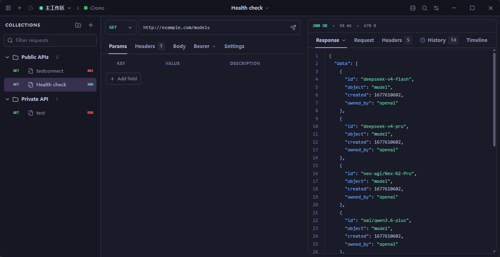

# Crono

[English](./README.md) | [简体中文](./README.zh-CN.md)

Crono is a local-first desktop API client built with Vue 3, Tauri 2, and Rust.
The current MVP covers local persistence, request editing, environments,
authentication, request execution, and response history.

> Version `0.1.0` is a development preview. Data stays on your machine by
> default; accounts, team collaboration, and cloud sync are not included.



## MVP Features

- Local CRUD for workspaces, folders, environments, and HTTP requests.
- SQLite WAL persistence, forward-only migrations, and multi-window model sync.
- GET, POST, and arbitrary HTTP methods.
- Query parameters, headers, Text/JSON bodies, and request timeouts.
- Inherited environment variables plus `{{$uuid}}` and `{{$timestamp}}`
  built-in templates.
- Basic, Bearer with a custom prefix, and API Key authentication.
- Request cancellation, streamed response-body storage, and
  status/header/JSON/text viewers.
- Request history and a basic timeline.
- English and Simplified Chinese interfaces, light/dark appearance, and
  multiple built-in themes.

The current MVP does not yet include Form, Multipart, Binary, Cookie Jar
behavior, redirect controls, proxy/TLS configuration, downloads, or paging for
large responses. See the [implementation status](./docs/IMPLEMENTATION_STATUS.md)
for the next increment.

## Tech Stack

- Desktop: Tauri 2
- Frontend: Vue 3, TypeScript, Vite, Pinia, Vue Router
- Backend: Rust, Tokio, Reqwest
- Storage: SQLite via Rusqlite
- Editing and viewing: CodeMirror 6
- Testing: Vitest and Cargo test

## Getting Started

Install the following prerequisites:

- Node.js 22 or a newer LTS release
- Stable Rust (the Rust 2024 edition requires Rust 1.85 or later)
- The platform-specific
  [Tauri 2 prerequisites](https://v2.tauri.app/start/prerequisites/)

Then install dependencies and start the desktop app:

```bash
npm install
npm run desktop:dev
```

To work on the web UI only:

```bash
npm run dev
```

Web-only mode does not provide SQLite, native HTTP, or other Tauri commands.

## Common Commands

```bash
npm run typecheck       # Type-check every TypeScript workspace
npm test                # Run frontend tests
npm run build           # Build the web frontend
cargo test --workspace  # Run Rust tests
cargo clippy --workspace --all-targets -- -D warnings
cargo fmt --all -- --check
npm run desktop:build   # Build desktop bundles
```

See [DEVELOPMENT.md](./DEVELOPMENT.md) for the repository layout, development
workflow, and complete verification checklist. Architecture decisions live in
[ARCHITECTURE.md](./ARCHITECTURE.md), and the IPC contract is documented in
[docs/contracts/ipc-v1.md](./docs/contracts/ipc-v1.md).

## Project Status

The Phase 1–3 goals are implemented. The next increment focuses on completing
the HTTP feature set. Refer to
[docs/IMPLEMENTATION_STATUS.md](./docs/IMPLEMENTATION_STATUS.md) for the exact
delivery status.

## License

MIT
